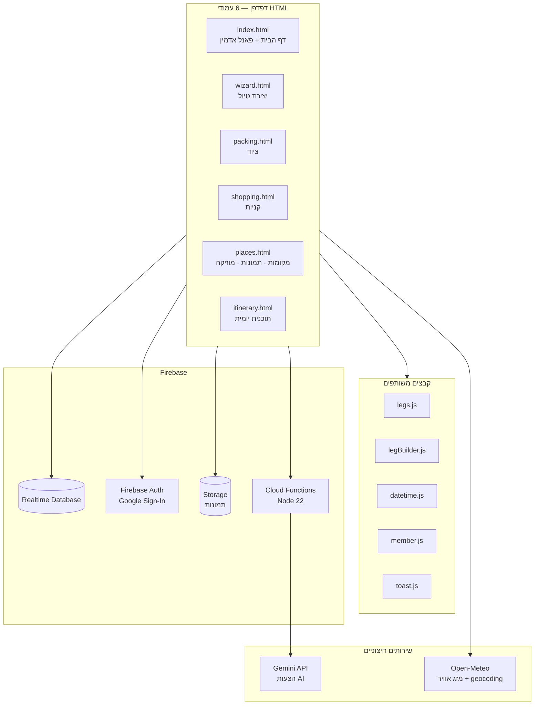
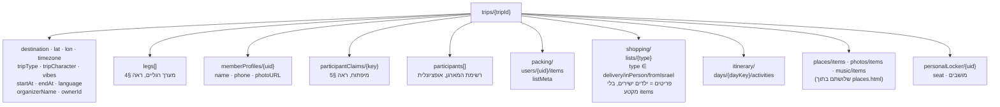
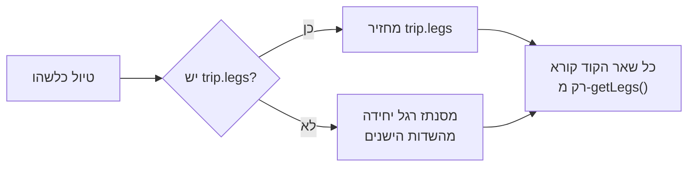
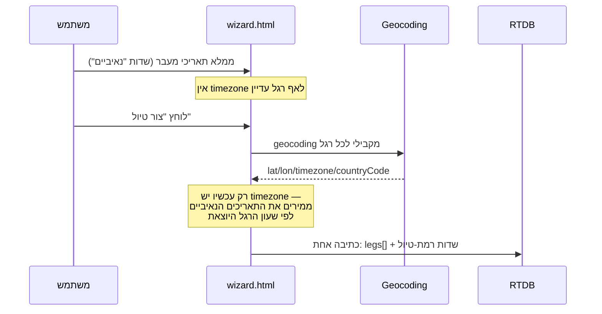
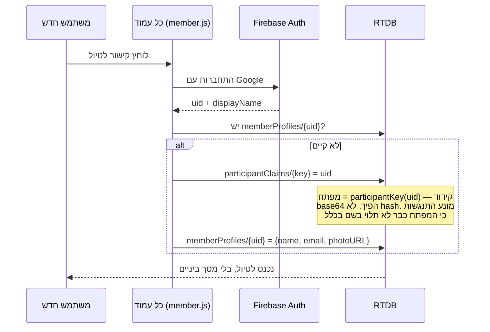
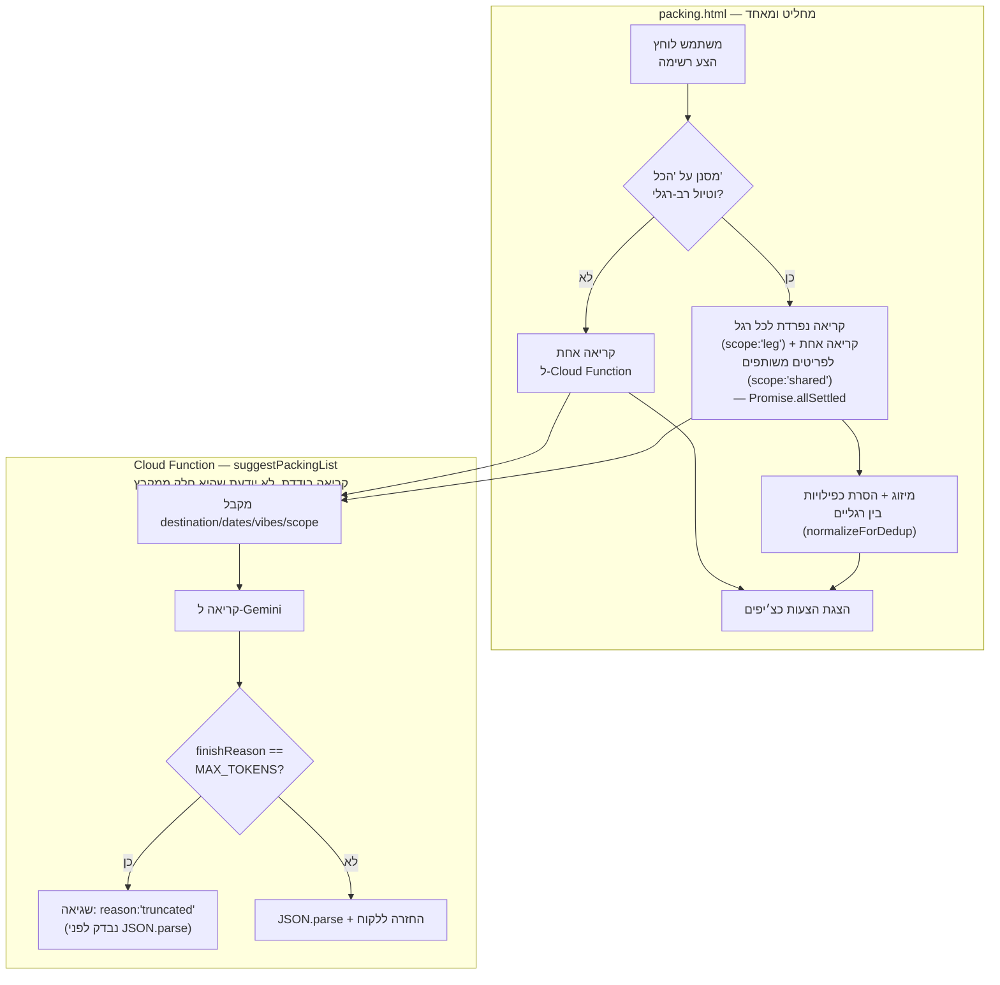
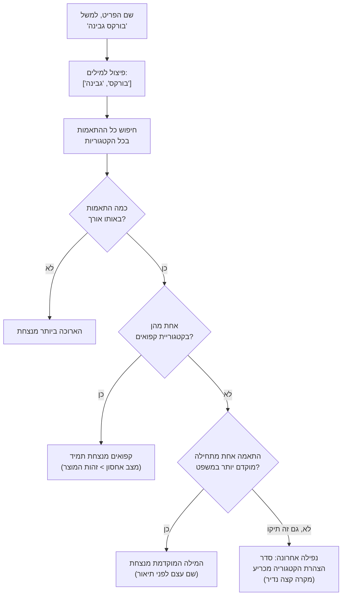

# GitTrip — מסמך ארכיטקטורה טכני

**מטרה**: תיעוד מקיף של איך האפליקציה בנויה ולמה — לא שיווקי,
לא מדריך משתמש. למי שרוצה להבין את המערכת מבפנים: אתה, מפתח
עתידי, או מי שאתה רוצה להראות לו את זה.

**מאומת מול הקוד בפועל** (לא רק מסיכום שיחות) — 2026-09-10.

---

## 1. מה זה בכלל

GitTrip הוא אפליקציית ווב (PWA) לתכנון טיולים קבוצתיים.
לא אפליקציית נייטיב — אתר סטטי שרץ ב-GitHub Pages, עם Firebase
כשכבת השרת. אין שרת משלו, אין בסיס נתונים יחסי, אין build step
מורכב — שישה קבצי HTML, כל אחד עולם בפני עצמו עם JavaScript
מוטבע.

**ההחלטה הארכיטקטונית המרכזית**: ריבוי-עמודים (multi-page)
במקום Single Page Application. כל מודול — ציוד, קניות, מקומות,
תוכנית — הוא קובץ HTML נפרד. זה נבחר במפורש על פני איחוד לדף
אחד, כי איחוד היה דורש state משותף, ניהול URL מורכב, ומתנגש
בארכיטקטורת הגלילה הקיימת (`100dvh` + `overflow:hidden` בכל
עמוד).

---

## 2. תרשים המערכת



**נקודה חשובה**: אין תקשורת בין העמודים חוץ מדרך RTDB. עמוד
לא יודע מה קרה בעמוד אחר אלא אם הוא קרא זאת מהמסד. זו הסיבה
שכל שינוי סכמה (למשל הוספת `legs`) חייב להיכנס לכל עמוד בנפרד.

---

## 3. מודל הנתונים

כל טיול הוא עץ אחד תחת `trips/{tripId}`:



**עקרון מרכזי**: `destination`/`lat`/`lon`/`timezone` ברמת
הטיול הם **כפילות מכוונת** — הם תמיד משקפים את הרגל הראשונה
(או האחרונה, ל-`timezone`/`endAt`). זה שומר על תאימות לאחור:
כל קוד ישן שקורא ישירות מהשדות האלה ממשיך לעבוד גם בטיול
מרובה-רגליים, בלי לדעת שרגליים בכלל קיימות.

---

## 4. יעדים מרובים (`legs`)

הפיצ׳ר המרכזי שהאפליקציה נבנתה סביבו בשבוע האחרון. טיול יכול
לכלול כמה יעדים ברצף — "ניו יורק → בנגקוק → הונולולו" — כל
אחד עם התאריכים, אזור הזמן והקואורדינטות שלו.

### מבנה רגל

```
legs[n] = {
  id: "leg_xyz123"      יציב. לא אינדקס — לא זז בשינוי סדר
  name: "בנגקוק"
  lat, lon: number
  timezone: "Asia/Bangkok"    IANA
  countryCode: "TH"           לדגל, אופציונלי — null בטיולים
                               שנוצרו לפני v4.23.0
  startAt, endAt: ISO string  בשעון הרגל עצמה
  vibes: string[]
}
```

**id יציב הוא קריטי**: פריטי ציוד, מקומות, ופעילויות מצביעים
עליו דרך `legId`. אם ה-id היה משתנה בכל עריכה (כמו שקרה בבאג
מוקדם יותר), כל שיוך היה מתנתק בשקט. נבדק בפועל: עריכת רגליים
קיימות דרך פאנל האדמין שומרת את ה-id המקורי של כל רגל, לא
מייצרת חדש.

### מסלול הקוד האחיד — `getLegs()`



זה העיקרון החשוב ביותר בכל מערכת ה-legs: **אין שני מסלולי
קוד**. שום פונקציה לא בודקת `if (trip.legs)`. כולן קוראות
`getLegs(trip)`, וטיול ישן בלי `legs` פשוט מקבל מערך של רגל
אחת שמורכבת מהשדות הישנים. מכאן — תאימות לאחור מלאה בלי
מיגרציה. נבדק: אף אחד מ-6 העמודים לא קורא `trip.legs`/`.legs`
ישירות כדי להסתעף על בסיסו בקריאה — המקומות היחידים שנוגעים
ב-`trip.legs` ישירות הם נקודות **כתיבה** (פאנל האדמין, כשעורכים
רגליים).

פונקציות נלוות: `getPrimaryLeg` (ראשונה), `getLastLeg`
(אחרונה), `getLegForDate(trip, date)` (הרגל שתאריך שייך
אליה — `null` אם התאריך בפער בין רגליים), `getCurrentLegTimezone`/
`getCurrentLegCoords`/`getCurrentLegName` (הרגל הפעילה עכשיו,
עם שרשרת נפילה: פעילה → אחרונה → מכשיר), וגם `isMultiLeg`,
`hasValidCoords`, `tripDayDates`.

### מודל הזמן

זו הנקודה העדינה ביותר במערכת. שלושה כללים:

1. **`trip.startAt`** נשאר בשעון **היוצר** (המכשיר של מי שיצר
   את הטיול) — לא עובר דרך הרגליים בכלל. הבחירה המקורית (למה
   דווקא שעון המכשיר) מעולם לא הוכרעה במודע — אבל **ההחלטה
   להשאיר את זה ככה** כן מתועדת במפורש, ב-`docs/schema-legs.md`
   §4 ("⚠️ trip.startAt — הנחה סמויה שלא הוכרעה"), עם שני
   נימוקים: השדות שונים סמנטית בכוונה, וכל תיקון עתידי כדאי
   שיהיה במקום אחד.
2. **`legs[0].startAt`** בשעון **הרגל עצמה** — שונה סמנטית
   מ-`trip.startAt`, גם אם הערך זהה בטיול חד-רגלי. בפועל, בקוד
   הכתיבה (`deriveTripFields`), `trip.startAt` נכתב כ-
   `legs[0].startAt` ממש — אותה מחרוזת, לא שני חישובים נפרדים
   שבמקרה מתלכדים.
3. **תאריך מעבר בין רגליים** מתפרש בשעון **הרגל היוצאת**.
   `legs[i].endAt === legs[i+1].startAt` — אותו ערך בדיוק,
   לא שני חישובים נפרדים. מובטח **במבנה הקוד עצמו** (שתי
   השדות נקראות מאותו אובייקט Date), לא רק מאומת אחרי העובדה.



---

## 5. הצטרפות וזהות

### הכלל: uid, לא שם — אבל שני מנגנוני מפתח עדיין חיים במקביל

בהיסטוריה המוקדמת של האפליקציה, זהות משתמש נקבעה על ידי בחירת
שם מרשימה שהמארגן הכין מראש (`participants[]`). זה יצר שני
כשלים: (א) מי שלא נצפה מראש נחסם לגמרי, (ב) מפתח מבוסס-שם
דרש ייחודיות מלאכותית.

**הפתרון**: הרשמה אוטומטית. כשמשתמש נכנס לטיול בפעם הראשונה,
נוצר לו `memberProfiles/{uid}` עם שם מ-Google, בלי שום מסך
ביניים.



**`participantKey()`** היא פונקציית קידוד אחת (base64
חד-חד-ערכי והפיך, **לא hash**) שמשמשת שתי זרימות שונות, על
קלטים שונים:

- **הזרימה החדשה** (auto-register, דיאגרמה למעלה) מקודדת את
  ה-**uid** — ומכאן שאין שום סיכון התנגשות: uid ייחודי מטבעו.
- **הזרימה הישנה** (`claimMember`, עדיין קיימת בדף הבית
  כברירת-מארגן/fallback) ממשיכה לקודד לפי **שם** — וזו בדיוק
  הזרימה שסובלת מהתנגשות בין שני "דני כהן". הודעת השגיאה
  ("השם הזה כבר שויך למשתתף אחר") עדיין קיימת בקוד, כי הזרימה
  הישנה עדיין קיימת.

הרשימה הישנה (`participants[]`) נשארת ככלי מעקב אופציונלי
למארגן, בלי קשר לזהות בפועל. אין התאמה אוטומטית בין
`participants[]` ל-`memberProfiles` — מי שברשימה **וגם** הצטרף
עלול להופיע פעמיים אם ננסה למזג אותן, ולכן לא ממזגים.

### שינוי שם (ומספר טלפון)

שם ומספר טלפון ניתנים לעריכה יחד (דף הבית בלבד, `saveProfile()`)
— כתיבה יחידה (`{name, phone}`) על אותו `memberProfiles/{uid}`.
לא נוגעת ב-`participantKey`, שנשאר קבוע כדי שהכללים ב-RTDB
ימשיכו לאשר את הכתיבה. (זו הרחבה של מנגנון מוקדם יותר שכתב רק
`name` — הורחב כשנוסף שדה הטלפון.)

---

## 6. הצעות AI

### ציוד — חלוקת התפקידים בין הלקוח ל-Cloud Function

**נקודה מרכזית**: ההסתעפות בין קריאה בודדת לקריאות-מקבילות-
לפי-רגל היא לוגיקה **בצד הלקוח** (`packing.html`), לא בתוך
ה-Cloud Function. ה-Function (`suggestPackingList`) היא endpoint
בודד, לא-מודע-להקשר — מקבלת פרמטר `scope` (`"leg"`/`"shared"`)
ומחזירה תשובה אחת ל-Gemini לכל קריאה. **הלקוח** הוא זה שמחליט
כמה פעמים לקרוא לה, קורא במקביל, ומאחד את התוצאות.



**לקח שכבר עלה פעמיים**: `maxOutputTokens` נמוך מדי (היה 500)
גרם לתשובות חתוכות ול-JSON שלא ניתן לפרסור — הפיצ׳ר "מת" בשקט
למשך חודשים לפני שהאבחון נמצא. הפתרון: זיהוי מפורש של
`finishReason === "MAX_TOKENS"` **לפני** ניסיון הפרסור, עם
הודעה נפרדת מכל כשלון אחר. הערך הנוכחי: 2000.

**הפרומפט מכוון במפורש**: שם פריט קצר (2-3 מילים, בלי תארים
מקשטים אלא אם הם באמת מבדילים), לא משפט. זה תוקן אחרי שהצעות
ראשונות חזרו עם תיאורים מקשטים שיצרו כפילויות כמעט-זהות
("מטרייה מתקפלת קלה" מול "מטרייה מתקפלת קומפקטית" — ר׳
CHANGELOG v4.11.9).

### הצעות למקומות — עדיין לא בנוי

**היחיד ברשימת הפיתוח עם פידבק אמיתי ממשתמש**: "למה זה לא
הציע לחברים דברים מעניינים". התובנה: השאלה הנכונה היא "מה
מפספסים", לא "מה מומלץ" — מודל שפה נוטה לחזור על מה שהכי
מתועד באינטרנט (בדיוק מה שכולם כבר יודעים).

היום, להצעות ציוד, נשלח ל-Gemini רק `vibes` — לא `tripCharacter`
(הוא משמש לעיצוב ולרשימות התחלתיות, לא נכנס לקריאת ה-AI בכלל).
להצעות מקומות אין כרגע שום קריאת AI, אז השאלה "מה נשלח" עוד
לא רלוונטית שם — תעלה כשהפיצ'ר ייבנה.

---

## 7. זיהוי קטגוריות

שני מנגנונים נפרדים, לשני עמודים שונים, עם היסטוריה שונה:

### ציוד — `CATEGORY_KEYWORDS`

ארבע קבוצות בלבד (תרופות ועזרה ראשונה, תיק רחצה, אלקטרוניקה,
מסמכים), משמשות ליצירת תת-פריט מקונן תחת פריט-הורה — לא בורר
קטגוריה כללי.

### קניות — `CATEGORY_DICTIONARY`

מנגנון נפרד ועצמאי, שהורחב באופן משמעותי: 413 מילות מפתח,
10 קטגוריות. שיטת ההתאמה — **prefix** (`startsWith`) על כל
מילה בשם הפריט בנפרד, לא הכלה גולמית (`includes`).

**כלל השבירה** (כשפריט מתאים לכמה קטגוריות בו-זמנית):



**הנימוק הלשוני**: בעברית, שם העצם קודם לתיאור — "בורקס
גבינה" (בורקס בטעם גבינה), "קמח לבן" (קמח, לבן). כלל
"המילה המוקדמת מנצחת" הוא בעצם "שם העצם מנצח את התיאור".

**החריג**: "תירס קפוא" — בלי החריג, הכלל הראשי היה בוחר
"תירס" (שם העצם) ומפספס שהפריט קפוא. מצב אחסון הוא שונה
מהותית מתיאור טעם, ולכן `קפואים` שוברת תיקו לפני שמגיעים
לכלל הראשי.

---

## 8. תשתית משותפת

כל אחד מהקבצים האלה נולד מאותו דפוס: פונקציה שהועתקה בין
כמה עמודים, השתבשה בהעתקה אחת ולא בשנייה, ונתפסה רק בבדיקה
מול נתון אמיתי.

| קובץ | תפקיד | דוגמה למה שהוא מונע |
|---|---|---|
| `legs.js` | קריאת מבנה הרגליים | `getLegs`, `getLegForDate`, `isMultiLeg` |
| `legBuilder.js` | בניית רגליים מטופס | משותף לוויזרד ולפאנל אדמין |
| `datetime.js` | חישובי אזור זמן | `zonedParts` היה משוכפל ב-3 עמודים |
| `member.js` | הרשמה אוטומטית | היה משוכפל כ-5 שערי בחירת-שם נפרדים |
| `toast.js` | הודעות מסך | `window.toast`, לא מתנגש עם toast מקומי |

**עיקרון**: קובץ חדש נוצר רק כשפונקציה משמשת שני עמודים
או יותר. תשתית לשימוש יחיד היא הפשטה מיותרת.

**מצב נוכחי, לא רק היסטוריה**: `toast.js` ו-`window.toast`
עדיין תשתית-בלבד — אין באפליקציה אף קריאה אחת ל-`window.toast`
מבחוץ, כל עמוד עדיין קורא לפונקציית ה-toast המקומית שלו. שני
מנגנוני toast חיים במקביל, לא אחד.

---

## 9. מסלול הבדיקה

זה לא חלק מהקוד עצמו, אבל הוא צורת העבודה שהתגבשה תוך כדי
פיתוח, ושווה לתעד כי היא הוכיחה את עצמה שוב ושוב:

1. **הסוכן בונה, בודק בסביבה מדומה, ומדווח**
2. **המשתמש מריץ שורת אימות אחת בקונסול על נתון אמיתי**
3. רק אחרי ששניהם עברו — commit

שלוש דוגמאות שבהן שלב 2 תפס מה ששלב 1 פספס:

- שדה הקואורדינטה נקרא `lon`, לא `lng` — בדיקה מול אובייקט
  מדומה תמיד "עברה" כי המדומה נבנה מהנחה שגויה
- `startAt`/`endAt` הם מחרוזות ISO, לא timestamps מספריים —
  אותה סיבה בדיוק
- "קורה עכשיו" מחושב נכון לפי שעון היעד — משתמש שהשווה
  לשעון שלו חשב שזה באג

**הכלל שנוסח מזה**: בדיקה מול אובייקט שבנית מאמתת את ההנחות
שלך, לא את הנתונים.

---

## 10. גרסאות ופריסה

- `version.js` — מקור אמת יחיד למספר הגרסה, `CHANGELOG.md`
  לצדו
- כל שינוי שנטען לדפדפן מקבל bump גרסה — גם אם עוד אף אחד
  לא קורא לו (תיעוד, לא רק פונקציונליות)
- תיעוד בלבד (README, roadmap) — בלי bump
- `firebase deploy --only functions` נפרד מ-`git push` —
  שינוי ב-Cloud Function דורש שני צעדים, לא אחד. (מבני:
  `firebase.json` מגדיר רק `functions`, בלי `hosting`/`database`
  — GitHub Pages אינו Firebase Hosting, זו שכבת פריסה נפרדת
  לגמרי.)
- GitHub Pages נכשל מדי פעם בפריסה בלי סיבה ברורה; commit
  נוסף פותר בדרך כלל

---

## מסמכים קשורים בריפו

- `docs/schema-legs.md` — תיעוד ההחלטות המלא של מערכת ה-legs
- `docs/roadmap.md` — מה נסגר, מה נשאר, סדר עדיפויות
- `CLAUDE.md` — הנחיות עבודה לסוכן, כולל צ׳ק-ליסט לפני commit
